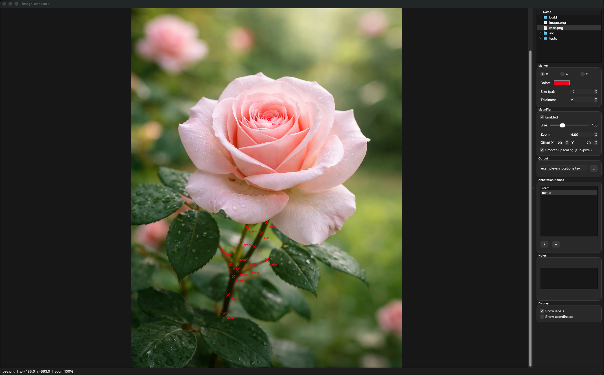
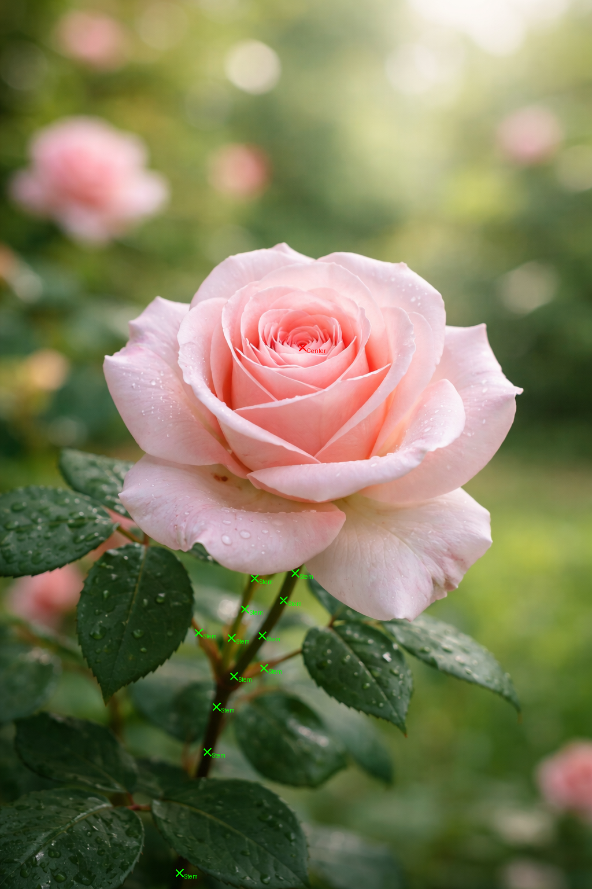

# Image Annotation App

This is an extremely simple vibe-coded app to create annotations from/for images.

## How to install

This assumes you have [uv](https://docs.astral.sh/uv/getting-started/installation/) installed.

```bash
git clone https://github.com/alphabet5/image-annotations.git
cd image-annotations
uv tool install --reinstall .
```

## How to use

```bash
image-annotate ui --images ./img --annotations ./example-annotations.tsv
```



Input/selected image


Output

```tsv
# image-annotate-session
# annotation-style	Center	X	#FF0000	12	2
# annotation-style	Stem	X	#04ff00	12	2
# zoom	1.0000
image-file	annotation-name	locationX(px)	locationY(px)	imageX(total width px)	imageY(total height px)
rose.png	Center	523.0000	600.0000	1024	1536
rose.png	Stem	510.0000	990.0000	1024	1536
rose.png	Stem	490.0000	1037.0000	1024	1536
rose.png	Stem	453.0000	1098.0000	1024	1536
rose.png	Stem	404.0000	1168.0000	1024	1536
rose.png	Stem	343.0000	1093.0000	1024	1536
rose.png	Stem	440.0000	999.0000	1024	1536
rose.png	Stem	423.0000	1052.0000	1024	1536
rose.png	Stem	400.0000	1102.0000	1024	1536
rose.png	Stem	456.0000	1154.0000	1024	1536
rose.png	Stem	374.0000	1221.0000	1024	1536
rose.png	Stem	358.0000	1299.0000	1024	1536
rose.png	Stem	310.0000	1508.0000	1024	1536
```

```bash
image-annotate generate-images --images ./img --annotations ./example-annotations.tsv
```


